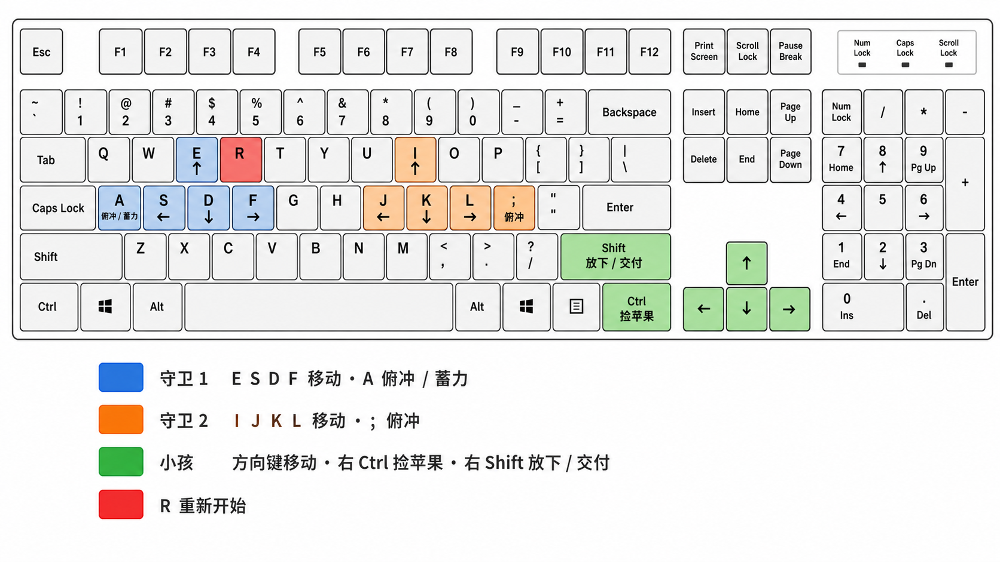

# Apple Picking · 果园追逐

一款使用 TypeScript、Three.js 和 Vite 开发的本地多人果园追逐游戏。两名守卫需要协作抓住偷苹果的 kid，kid 则要在速度因负重下降前把六个苹果留在目标圆圈内。

## Quick Start

准备 Node.js 20.19+ 或 22.12+ 和 npm，然后在仓库根目录执行：

```bash
npm install
npm run dev
```

浏览器打开 <http://127.0.0.1:5188>。

地图编辑器位于 <http://127.0.0.1:5188/editor.html>，也可以从游戏左上角的“当前地图”入口进入。

生产构建与本地预览：

```bash
npm run build
npm run preview
```

预览地址为 <http://127.0.0.1:4188>，构建产物位于 `dist/`。

## 开发调试面板

运行 `npm run dev` 时，页面右上角会显示“开发调试 · DEV”面板，可以实时调整：

- 点击“进入鼠标调镜头”后，可直接在游戏画布上用滚轮缩放、左键拖拽绕画面中心旋转、右键拖拽沿屏幕左右/上下移动；再次点击按钮退出并保留本轮参数。
- 鼠标模式中面板只保留实时镜头读数：横屏倾角、画面缩放、镜头位置 `X / Y / Z` 和朝向目标 `X / Y / Z`，方便把最终参数直接发给开发者。
- 正交镜头缩放、环境光、主光以及减少动态效果。
- “恢复推荐值”可以一键撤销本轮临时调整。

Three.js 中 `Y` 轴是上下方向，`X` 与 `Z` 轴构成地面；“朝向目标”是镜头正在看的世界坐标，比直接调欧拉角更不容易产生方向混乱。位置与目标调整当前用于横屏构图，窄屏仍使用固定 25° 镜头。该面板只在开发服务器中创建，`npm run build` 的正式页面不会显示。

## 操作方式

当前版本是同键盘本地多人游戏：



| 角色 | 移动 | 动作 |
| --- | --- | --- |
| guard1 | `E` 上、`S` 左、`D` 下、`F` 右 | `A` 飞扑 |
| guard2 | `I` 上、`J` 左、`K` 下、`L` 右 | `;` 飞扑 |
| kid | 方向键 | `Right Ctrl` 拾取；`Right Shift` 丢弃或在目标圈内送达 |

按 `R` 重新开始。当前手机视口已适配画面与 HUD，但正式触控输入仍待实现。

## 核心规则

- 守卫累计抓住 kid 三次获胜。
- kid 让六个苹果同时留在目标圆圈内即可获胜；苹果被挤出圆圈后会立即扣除送达数量。
- kid 最多携带三个苹果，携带越多移动越慢；满载移动时会出现姿态变化、苹果堆和滴汗。
- 守卫飞扑落地后会短暂爬起；两名守卫同时飞扑相撞时进入受控状态。
- 人物之间具有碰撞；未携带的苹果都较轻，包括已计分的苹果，被人物碰到后会被推开。

## 地图编辑器

- 可玩区域为 `72 × 54`，长宽都是初版的 3 倍；“随机地图实验室”提供果园村口、池塘花园、开阔果园三种预置。相同种子、开放程度和地标覆盖率会生成相同的候选。
- 每次先生成至少 12 张地图，再按可玩性和结构差异筛选四张。地图以连续开放场地为主体，房屋小院和池塘形成需要绕行的地标岛，不再把可见道路当成路线骨架。
- 默认“果园村口”有 86 个小树桩和 7 棵大树。树桩按人物比例缩小，树木只用于边界和方向点缀；苹果则为拾取可读性保留夸张尺寸。
- 画布支持种树、擦除、放置房屋小院/池塘、铺果园地块/草地空场、放置果实，以及移动三个角色起点与投递区。房屋、整个院落和水面都不可进入。
- 编辑过程支持撤销与重做。可游玩检查会验证地标/树木/果实数量、开放面积、边界和全部关键目标的可达性；不合法地图不能进入游戏，v1–v3 地图会自动迁移为 v4。
- “保存地图”写入浏览器本地图库；“使用并游玩”把当前地图设为游戏地图。导出/导入使用可读的 JSON 文件，便于分享和版本管理。

## 为什么选择 Three.js

1. **面向鸿蒙的交付路径更直接。** 许多传统游戏引擎没有直接面向鸿蒙的成熟支持，而 Three.js 游戏本质上是 Web 应用。
2. **更适合 AI 辅助开发。** TypeScript、DOM、浏览器调试协议和可观测的运行时状态便于生成、检查和修改，也更容易使用 Playwright 做自动化操作与回归测试。
3. **本地调试和 ArkWeb 移植使用同一技术栈。** 开发阶段可以直接在桌面浏览器运行，构建后的静态资源可进一步集成到鸿蒙的 ArkWeb 组件中，减少跨引擎迁移成本。

Three.js 同时允许项目把确定性玩法规则与 3D 表现分开：规则层不依赖渲染器，角色模型、动画、材质和特效可以独立迭代。

## 常用命令

| 命令 | 用途 |
| --- | --- |
| `npm run dev` | 在 `127.0.0.1:5188` 启动 Vite 开发服务器 |
| `npm run build` | 运行严格 TypeScript 检查并生成 `dist/` |
| `npm run preview` | 在 `127.0.0.1:4188` 预览生产构建 |
| `npm test` | 运行完整 Playwright 规则与浏览器测试 |
| `npm run verify:visual` | 运行 canvas、HUD 和响应式视觉检查 |
| `npm run inspect:canvas` | 采集 canvas 像素、截图和渲染预算诊断 |

Playwright 使用本机安装的 Google Chrome。测试固定为单 worker，避免多个 WebGL 上下文争抢 GPU 导致时序波动。

## 项目结构

```text
src/main.ts          应用入口
src/editor/          独立地图编辑器
src/core/            输入、循环和渲染器基础设施
src/game/            确定性规则、地图生成、状态和共享类型
src/render/          Three.js 场景、角色和资产表现
src/systems/         HUD、音频、碰撞辅助和 VFX
src/entities/        可复用实体代码
src/utils/           通用工具
tests/               Playwright 规则与浏览器测试
scripts/             canvas 检查和维护脚本
docs/                设计方案、实施记录和资产台账
public/assets/       运行时音频与 3D 资产
```

`GameSimulation` 使用固定时间步并保持独立于 Three.js。渲染、HUD 和音频只消费快照或事件，不应反向持有玩法规则。

## 外部素材与许可

项目目前使用 Kenney、KayKit 的 CC0 音效、角色与小屋素材，以及 Gostbento 的 CC BY 4.0 Nature Pack 树木和苹果。采用的具体文件、模型节点、修改方式和来源记录在 [外部资产许可台账](docs/ASSET_LICENSES.md) 中。

不要把完整素材包或来源不明的重新打包资源提交到仓库。新增资产应先记录许可证，再检查文件大小、三角面、材质、纹理、动画和手机端表现。

本地持有 `assets/KayKit_Adventurers_2.0_FREE/` 源包时，可运行 `npm run prepare:kaykit-characters` 重新生成项目使用的 Knight 与 Rogue GLB。`assets/` 已被忽略，仓库只提交 `public/assets/` 下的整理结果。

## 鸿蒙 / ArkWeb 集成提示

Web 版本的发布入口是 `dist/index.html`。集成 ArkWeb 前需要确认：

- ArkWeb 加载方式与 Vite `base` 配置一致；当前构建默认使用站点根路径。
- `dist/assets/` 和 `public/assets/` 生成的资源能够从目标路径访问。
- 键盘 MVP 需要补充触控输入桥接，并验证 pointer cancel、页面失焦和横竖屏切换。
- 在目标设备上重新检查 DPR、WebGL 能力、音频首次交互解锁和内存预算。

## 设计与实施文档

- [语义化乡野地图生成器讨论稿](docs/2026-08-15_semantic-world-generation-discussion.md)
- [视觉精修与状态表现方案](docs/2026-08-15_apple-picking-visual-polish-plan.md)
- [免费素材接入与低风险实施计划](docs/2026-08-15_free-asset-integration-plan.md)
- [外部资产许可台账](docs/ASSET_LICENSES.md)
